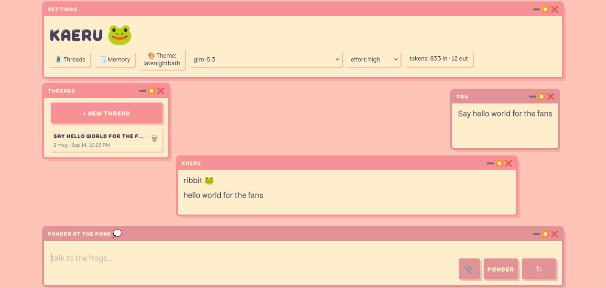

# Kaeru

Kaeru is a personal, single-user agent with a platform-agnostic core and thin frontends on top.

It was mainly created to experiment with LLMs and to fit my specific need and vision for a personal agent (Asking it how many r are in strawberry).
I wanted something playful, bright and cute with support for various themes based on my own design and not the constant slop of ChatGPT-like UIs.

The bot is able to **perform web searches**, execute **python in an isolated sandboxed environment** with consent by the user on every step, and keep **memories** including a self **reflection** of itself and its ***persona every evening**.
For example, my version has started having brainrot after speaking with me which I take as a compliment 🐸👍

Being a personal fun project also means that I will make breaking changes without warning. I do not advice anyone outside of friends to use it. Development is done against a fairly large private Arc42 project document because that's one of the only big takeways from my degree 🫪

The main frontend is a localhost web UI that streams from any OpenAI-compatible provider (OpenRouter, Ollama,
LM Studio, vLLM, llama.cpp).

## Getting Started

Simply running `cargo run` is enough, you can also pass `--fake` if you want to run the keyless demo UI.
You can also trigger quite a few tests via `cargo test` because LLMs really love writing tests :P (1:0 for them I guess ...)

Everything is configured in `data/config.toml`, created on first run.

The Python tool additionally needs Linux with `bwrap` and `uv` on `PATH`, without them the server refuses to start.

While the frontend does have a security key, it is designed to still be deployed behind gated access, such as a Cloudflare Tunnel with access restrictions. It should never be directly exposed to the public internet otherwise you are on your own.

It also does not come with its own pre-configured persona.md ("system prompt"), create one yourself :)

## License

European Union Public Licence v1.2, see [LICENSE](LICENSE).
